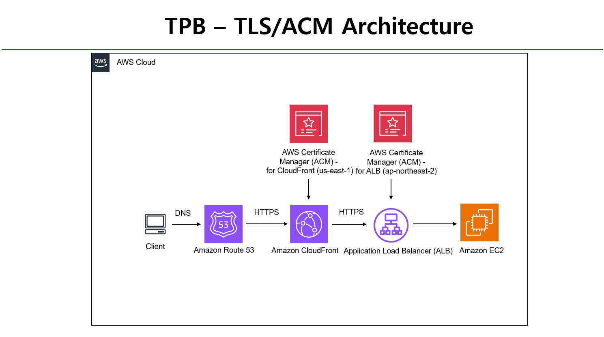
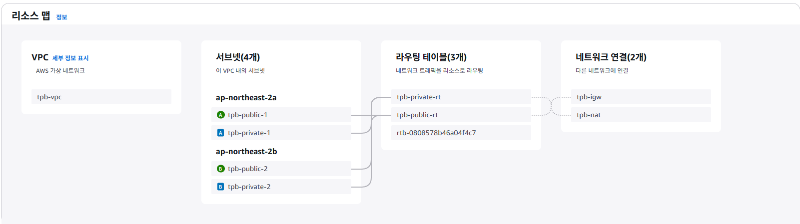
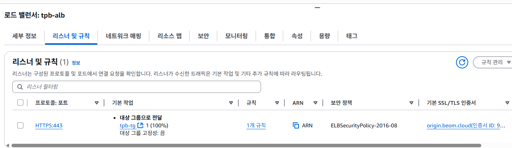
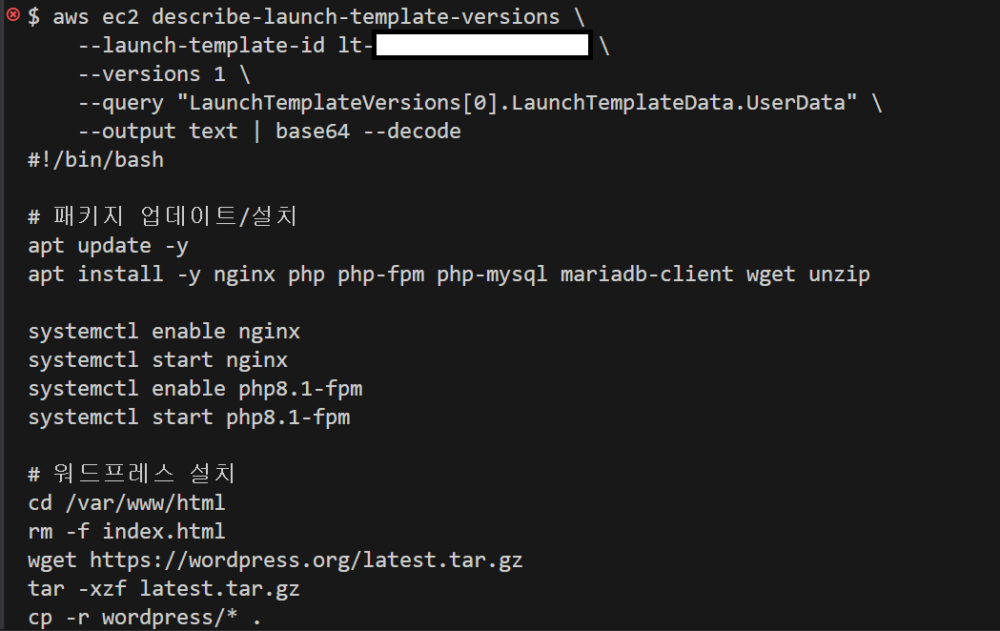
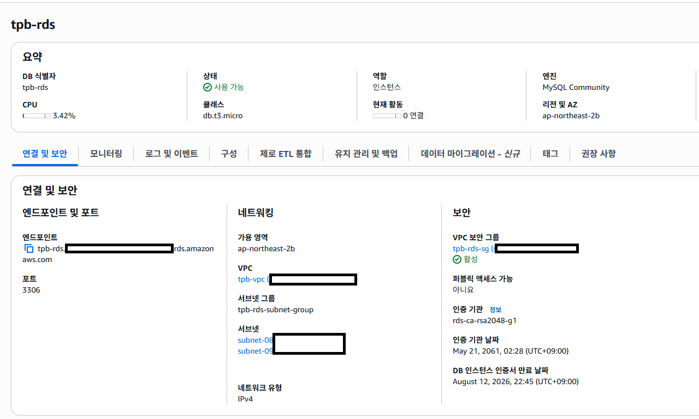
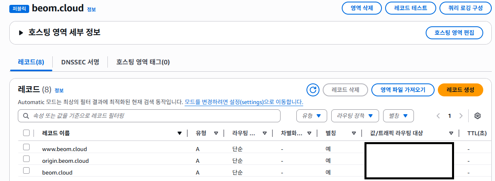
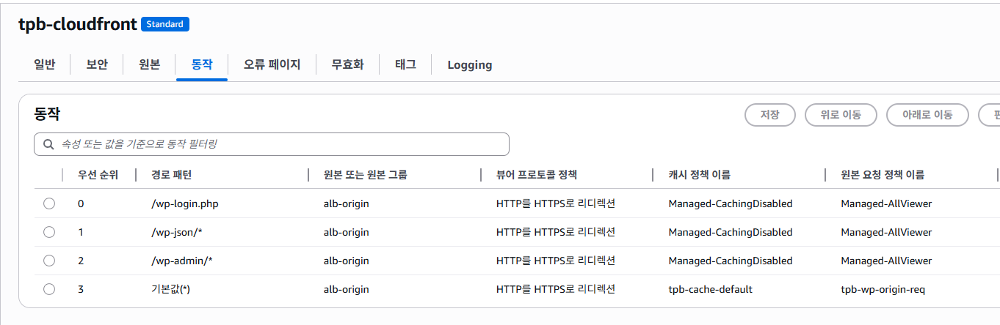
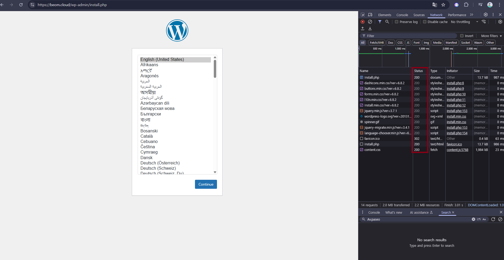
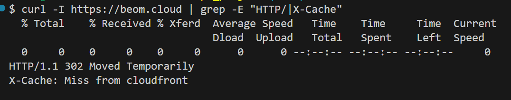

# TPB — AWS · Terraform 기반 WordPress HTTPS 인프라

## 📌 인프라 구성 흐름

### 1. 전체 아키텍처
  
CloudFront → ALB(HTTPS) → EC2(ASG) → RDS / Route 53·ACM 연결 구조

---

### 2. TLS 적용 구조
  
CloudFront(us-east-1)와 ALB(ap-northeast-2)에서 단계별 HTTPS 처리

---

### 3. VPC & 서브넷 구성
  
퍼블릭·프라이빗 서브넷을 AZ별로 분리 배치

---

### 4. ALB 리스너 & 인증서
  
:80 → :443 리다이렉트, :443 → Target Group Forward (ACM 적용)

---

### 5. Auto Scaling & WordPress 설치
  
UserData로 EC2 부팅 시 Nginx·PHP-FPM·WordPress 자동 설치

---

### 6. RDS & 보안 그룹
  
Private Subnet에 배치, EC2 SG 참조만 허용

---

### 7. Route 53 레코드
  
root/www → CloudFront, origin → ALB (A-ALIAS)

---

### 8. CloudFront 배포
  
Origin HTTPS-Only, 캐싱 정책 적용

---

### 9. HTTPS 동작 확인
  
HTTP 접속 시 HTTPS로 강제 전환

---

### 10. CloudFront 응답 헤더
  
HTTP/2, X-Cache 확인

---

### 11. Terraform 배포 로그
  
`terraform apply` 성공 후 리소스 생성 요약
