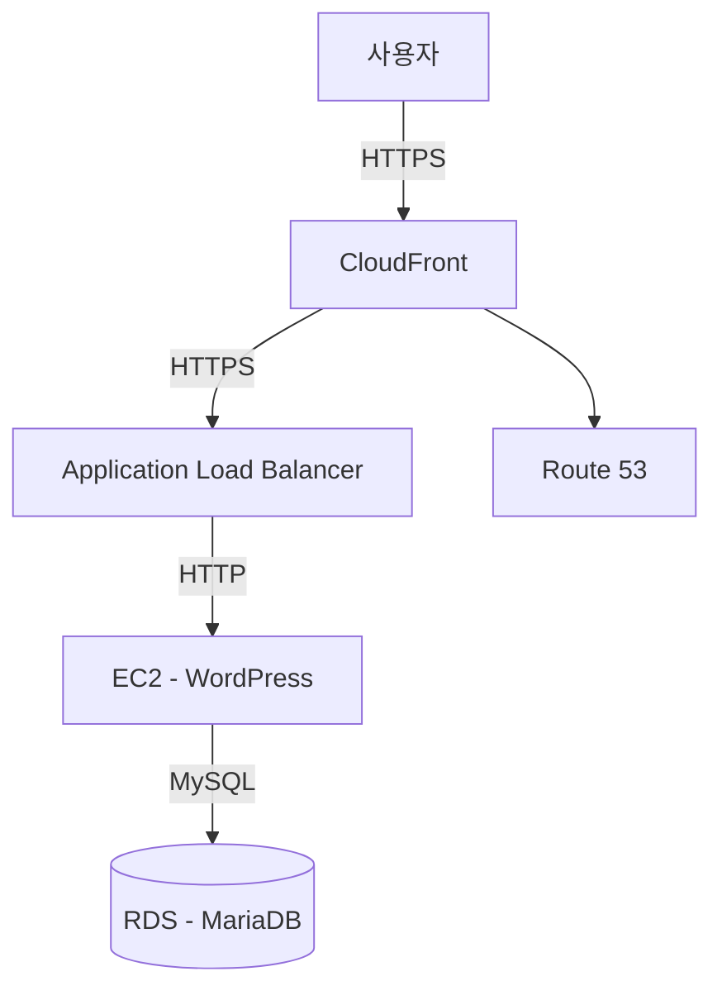

# Terraform으로 구축하는 AWS WordPress HTTPS 인프라

## 📌 개요
이 저장소는 Terraform을 이용해 AWS 환경에 **완전 자동화된 WordPress 인프라**를 배포하는 코드입니다.  
**CloudFront + ALB + EC2 + RDS + Route 53 + ACM** 구조를 통해 HTTPS를 지원하며,  
`terraform apply` 한 번으로 운영 가능한 환경을 재현할 수 있도록 구성했습니다.

---

## 🏗 아키텍처

---

📂 프로젝트 구조
seocho_project/
├── main.tf                 # 루트 모듈
├── variables.tf            # 변수 선언
├── terraform.tfvars        # 환경 변수 값
├── modules/
│   ├── vpc/                 # VPC 및 네트워크
│   ├── ec2/                 # EC2 및 UserData (WordPress 설치)
│   ├── rds/                 # MariaDB RDS 인스턴스
│   ├── alb/                 # ALB 구성
│   ├── cloudfront/          # CloudFront 배포 및 정책
│   ├── acm/                 # ACM 인증서 발급
│   └── route53/             # DNS 레코드 설정

---

⚙ 사전 준비
- AWS 계정과 IAM 권한

- Terraform 1.5 이상

- Route 53에 등록된 도메인

---

## 🚀 배포 방법

# 1. Terraform 초기화
terraform init

# 2. 계획 확인
terraform plan

# 3. 인프라 생성
terraform apply -auto-approve

---

## 🔐 HTTPS 구성 방식
CloudFront: CDN 역할 및 HTTPS 강제 리다이렉션

ALB: ACM 인증서를 이용해 TLS 종료 처리

UserData: 프록시 뒤에서도 WordPress가 HTTPS를 인식하도록 설정

Origin Request Policy: Host와 CloudFront-Forwarded-Proto 헤더 전달

---

## ✅ 검증 절차
https://도메인 접속 시 WordPress 설치 페이지가 나오는지 확인

브라우저 잠금 아이콘으로 인증서 정상 동작 확인

curl -I로 요청 시 X-Cache: Hit from cloudfront 확인

https://origin.도메인 접속 시 ALB 직통 페이지 출력 확인

---

## 🛠 문제 해결 예시
ALB HTTPS 접속 불가 → ACM 인증서 발급 후 ALB 443 리스너에 연결

HTTPS 인식 불가 → wp-config.php에 X-Forwarded-Proto 처리 코드 추가

캐시 정책 오류 → no_cache / cache_default 정책 분리 적용

## 📌 향후 개선 방향
AWS WAF 적용으로 보안 강화

CloudWatch 모니터링 및 알람 설정

CI/CD 파이프라인 구축으로 자동 배포 지원

