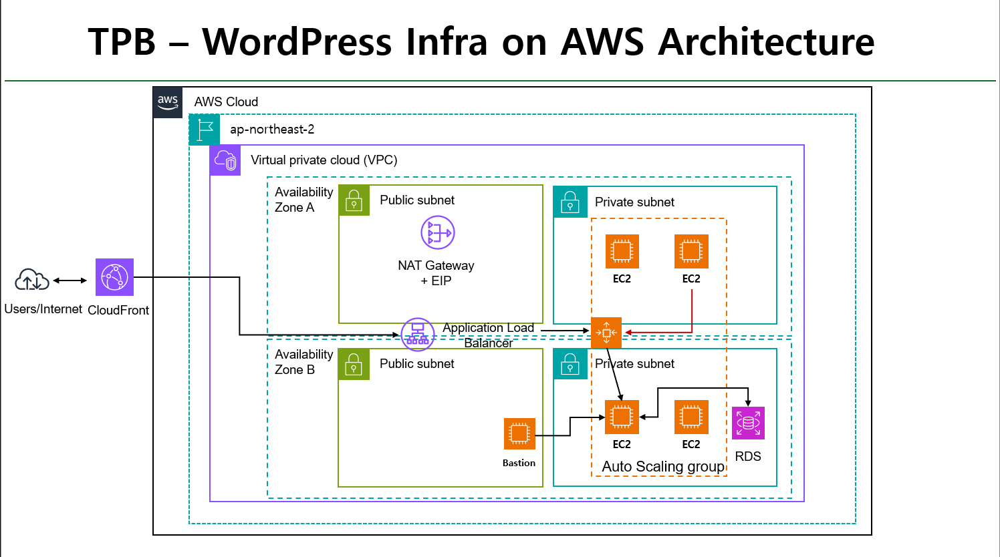
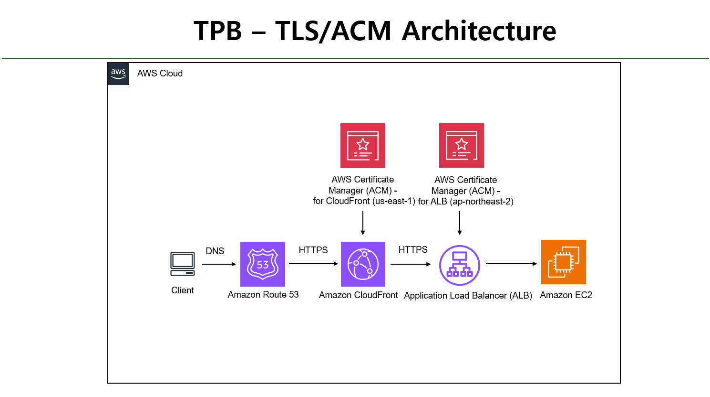

# 🌐 TPB Project — AWS WordPress HTTPS Infra (Terraform)

## 프로젝트 설명
Terraform으로 **CloudFront → ALB(HTTPS) → EC2(ASG, WordPress) → RDS(MySQL)** 인프라를 자동 구축합니다.  
도메인(Route 53)과 인증서(ACM: us-east-1/서울)까지 포함해 **`terraform apply` 한 번**으로 HTTPS 환경의 WordPress를 배포합니다.

- 상태: **구현 완료(실행 검증)** · 운영 확장 가능
- 모듈: VPC, ALB, EC2(Launch Template/ASG/UserData), RDS, CloudFront, Route 53, ACM, Bastion(옵션)
- 네이밍: `project_name` 접두사로 리소스/태그 일관성
- 보안: RDS Private Subnet 격리, SG 최소권한(EC2 SG 참조), HTTPS 강제

---

## 🏗 Architecture

### 1) WordPress Infra on AWS


- **DNS**: Route 53 — `root/www → CloudFront`, `origin → ALB` (A-ALIAS)
- **CDN/SSL**: CloudFront (ACM in **us-east-1**), HTTPS 강제
- **오리진**: ALB(HTTPS) → EC2 Auto Scaling (UserData로 WP 자동 설치)
- **DB**: RDS(MySQL 8), Private Subnet, EC2 SG만 허용
- **네트워킹**: VPC, Public/Private Subnet, NAT GW(기본 1개, 옵션: AZ별)

### 2) TLS/ACM Architecture


- **ACM (for CloudFront)**: **us-east-1**에 배치 (CloudFront 제약)
- **ACM (for ALB)**: **ap-northeast-2**에 배치 (오리진 HTTPS)
- **프로토콜**: Client→CF **HTTPS**, CF→ALB **HTTPS**, ALB→EC2 **HTTP:80**

> 이미지 파일은 레포 내 `docs/architectures/` 폴더에 저장하세요.  
> 파일명: `infra-architecture.png`, `tls-acm-architecture.png`

---

## Workflow

### 1) 런타임 요청 흐름 (Runtime Request Flow)
1. **사용자 → Route 53** : DNS 조회
2. **사용자 → CloudFront (HTTPS)** : TLS 종단(ACM in us-east-1), 캐시/정책 적용
3. **CloudFront → ALB (HTTPS)** : `origin_protocol_policy = "https-only"` (TLS1.2+)
4. **ALB → EC2(Target Group, HTTP:80)** : 헬스체크(200–399), ASG 스케일
5. **EC2 → RDS(MySQL)** : Private Subnet 통신(외부 비공개)
6. **응답** : EC2 → ALB → CloudFront(캐시/압축) → 사용자

> 프록시 환경 인지: `wp-config.php` & Nginx에서 `X-Forwarded-Proto`/`CloudFront-Forwarded-Proto` 처리로 HTTPS URL 고정

### 2) 프로비저닝 배포 흐름 (Provisioning Flow)
1. `terraform init` → 프로바이더/플러그인 초기화(us-east-1 별도 provider 포함)
2. `terraform plan` → 변경사항 검토
3. `terraform apply` → VPC → ALB/EC2/ASG → RDS → ACM(검증) → CloudFront → Route 53 순
4. 검증 → `https://<도메인>` 접속, `curl -I`의 `X-Cache` 확인, TG Healthy 확인

---

## 빠른 시작
```bash
terraform init
terraform fmt -recursive && terraform validate
terraform plan  -var-file="terraform.tfvars"
terraform apply -var-file="terraform.tfvars"
```

## 요구사항
- Terraform ≥ 1.5
- AWS 자격 증명(profile 또는 env)
- Route 53 호스티드 존

---

## 변수 요약 & 사용처
| 변수 | 설명 | 주요 사용처 |
|---|---|---|
| `project_name` | 리소스/태그 접두사 | 모든 모듈 네이밍/태그 |
| `domain` | 루트 도메인 | ACM(us-east-1), CloudFront Aliases, Route 53 |
| `allowed_ip` | SSH 허용 CIDR | Bastion SG(Ingress) |
| `key_name` | SSH 키 페어 | Bastion/EC2 |
| `ami_id` / `instance_type` | AMI/타입 | Bastion/EC2(Launch Template) |
| `instance_class` | RDS 클래스 | RDS 인스턴스 |
| `db_name`/`db_user`/`db_password` | DB 정보 | RDS 생성, EC2 UserData의 `wp-config.php` 치환 |

예시(`terraform.tfvars.example`)
```hcl
project_name   = "tpb"
domain         = "example.com"
allowed_ip     = "1.2.3.4/32"
key_name       = "YOUR_KEY_NAME"
ami_id         = "ami-xxxxxxxx"
instance_type  = "t3.nano"
instance_class = "db.t3.micro"
db_name        = "wordpress"
db_user        = "admin"
db_password    = "<set-in-your-own-tfvars>"
```

---

## 구현 스크린샷 (선택)
> 이미지를 `tpb-project/docs/screens/` 폴더에 넣고 아래 경로를 맞춰주세요.

- **Route 53 — Alias 레코드**  
  `docs/screens/02-route53-alias.png`  
  

- **CloudFront — 배포/동작 정책**  
  `docs/screens/03-cf-distribution.png`  
  

- **ACM — us-east-1 / 서울**  
  `docs/screens/04-acm-us-east-1.png` / `docs/screens/05-acm-seoul.png`  
  
  

- **ALB — 443 리스너 & 룰**  
  `docs/screens/06-alb-listeners.png`  
  

- **Target Group — Health**  
  `docs/screens/07-tg-health.png`  
  

- **ASG / RDS / VPC**  
  `docs/screens/08-asg.png` / `docs/screens/09-rds.png` / `docs/screens/10-vpc-subnets-nat.png`  
  
  
  

- **WordPress — HTTPS 접속**  
  `docs/screens/12-wp-https-home.png`  
  

---

## 트러블슈팅
- **HTTPS 미동작** → ALB 443 리스너/ACM 연결 확인
- **리다이렉션 루프** → `wp-config.php` HTTPS 인지 코드 및 Nginx `fastcgi_param HTTPS` 확인
- **DNS 전파 지연** → Route 53 TTL/전파시간(수분~수십분) 고려
- **CF 캐시 무효화** → 변경 반영 필요 시 Invalidation 수행

---


- Author: Beom · [Velog link](https://velog.io/@go_sbchi/project-tpb)
